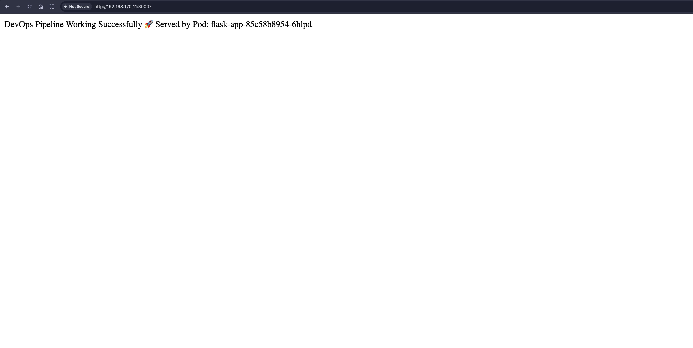
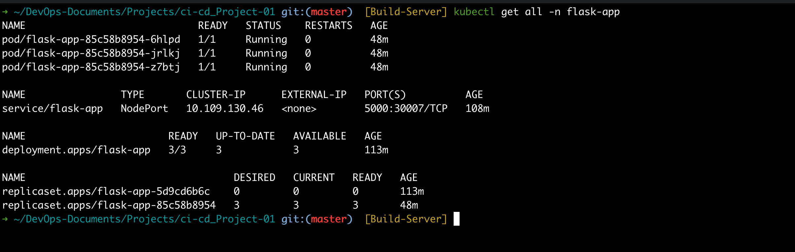
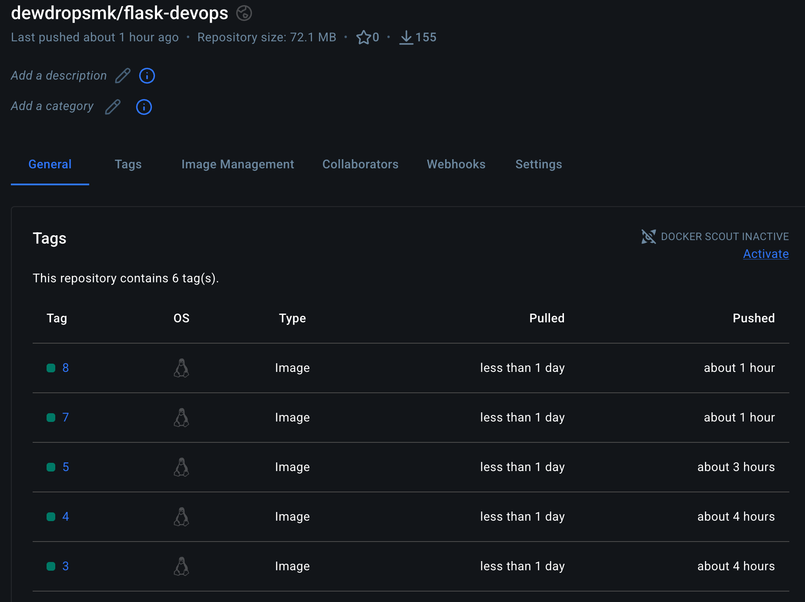
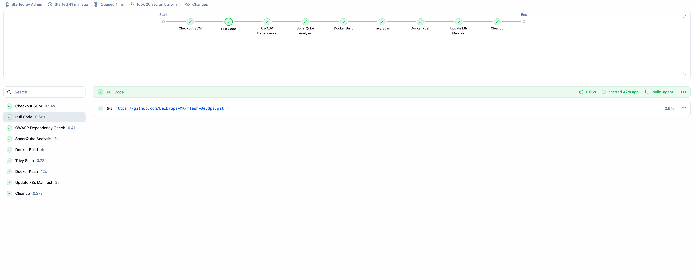
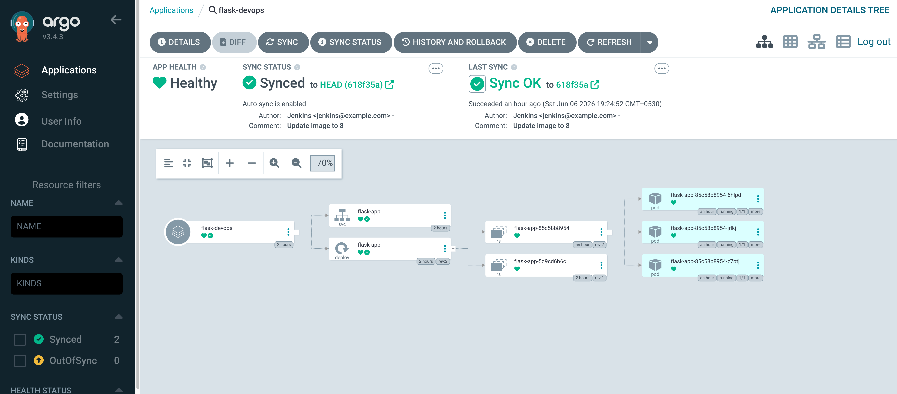

# Flask DevOps CI/CD and GitOps Project

This project is a hands-on DevOps practice project built to refresh and strengthen CI/CD, containerization, Kubernetes, GitOps, and DevSecOps skills after a gap of a couple of years.

The project demonstrates how a simple Flask application can move from source code to a running Kubernetes workload using Jenkins, Docker, Docker Hub, Kubernetes, Argo CD, and security scanning tools.

## Project Highlights

- Python Flask application running on port `5000`
- Dockerized application image
- Jenkins CI/CD pipeline for build, scan, push, and manifest update
- OWASP Dependency Check for dependency scanning
- SonarQube for code quality analysis
- Trivy for Docker image vulnerability scanning
- Docker Hub image publishing with build-number tags
- Kubernetes Deployment with 3 replicas
- Kubernetes NodePort Service exposed on port `30007`
- Argo CD GitOps deployment with Healthy and Synced application state

## Screenshots

### Application Running Through NodePort

The Flask application is accessible from the Kubernetes NodePort service. The response also shows the pod hostname, proving that traffic is served by a running Kubernetes pod.



### Kubernetes Resources

The application is running in the `flask-app` namespace with 3 healthy pods, a Deployment, ReplicaSets, and a NodePort Service.



### Docker Hub Image Repository

Docker images are pushed to Docker Hub with Jenkins build-number tags.



### Jenkins Pipeline Success

The Jenkins pipeline completes all stages successfully, including code checkout, dependency scanning, SonarQube analysis, Docker build, Trivy scan, Docker push, Kubernetes manifest update, and cleanup.



### Argo CD GitOps Sync

Argo CD monitors the Git repository and syncs the Kubernetes manifests into the cluster. The application is shown as `Healthy` and `Synced`.



## Demo Evidence

The following demo outputs show the complete CI/CD and GitOps flow working successfully.

### Kubernetes Workloads

```bash
kubectl get all -n flask-app
```

```text
NAME                             READY   STATUS    RESTARTS   AGE
pod/flask-app-85c58b8954-6hlpd   1/1     Running   0          48m
pod/flask-app-85c58b8954-jrlkj   1/1     Running   0          48m
pod/flask-app-85c58b8954-z7btj   1/1     Running   0          48m

NAME                TYPE       CLUSTER-IP     EXTERNAL-IP   PORT(S)          AGE
service/flask-app   NodePort   10.109.130.46  <none>        5000:30007/TCP   108m

NAME                        READY   UP-TO-DATE   AVAILABLE   AGE
deployment.apps/flask-app   3/3     3            3           113m

NAME                                   DESIRED   CURRENT   READY   AGE
replicaset.apps/flask-app-5d9cd6b6c    0         0         0       113m
replicaset.apps/flask-app-85c58b8954   3         3         3       48m
```

### Docker Hub Image Tags

The Docker Hub repository `dewdropsmk/flask-devops` contains Jenkins build-number tags, including tag `8`, which was pushed about 1 hour ago and pulled successfully during deployment.

### Application Access

The application is exposed through the Kubernetes NodePort service:

```text
http://192.168.170.11:30007
```

Example browser response:

```text
DevOps Pipeline Working Successfully - Served by Pod: flask-app-85c58b8954-6hlpd
```

### Jenkins Pipeline Run

The Jenkins pipeline completed successfully with these stages:

1. Checkout SCM
2. Pull Code
3. OWASP Dependency Check
4. SonarQube Analysis
5. Docker Build
6. Trivy Scan
7. Docker Push
8. Update k8s Manifest
9. Cleanup

### Argo CD Application Status

Argo CD shows the `flask-devops` application as:

- App Health: `Healthy`
- Sync Status: `Synced`
- Last Sync: `Sync OK`
- Target revision: `618f35a`
- Deployed image update comment: `Update image to 8`

## Architecture Flow

```text
Developer pushes code to GitHub
        |
        v
Jenkins pipeline starts
        |
        v
Checkout code -> OWASP scan -> SonarQube analysis
        |
        v
Docker build -> Trivy image scan -> Docker push
        |
        v
Jenkins updates Kubernetes manifest with new image tag
        |
        v
Manifest update is pushed back to GitHub
        |
        v
Argo CD detects Git change
        |
        v
Argo CD syncs application to Kubernetes
        |
        v
Application runs on Kubernetes through NodePort
```

## Tech Stack

- Python
- Flask
- Docker
- Docker Hub
- Jenkins
- Kubernetes
- Argo CD
- SonarQube
- OWASP Dependency Check
- Trivy
- GitHub

## Project Structure

```text
.
|-- app.py
|-- Dockerfile
|-- Jenkinsfile
|-- README.md
|-- requirements.txt
|-- docs
|   `-- screenshots
|-- k8s
|   |-- deployment.yaml
|   `-- service.yaml
```

## Application Details

The Flask app has a single route:

```text
/
```

It returns a success message and the hostname of the pod or container that served the request.

Example response:

```text
DevOps Pipeline Working Successfully - Served by Pod: flask-app-85c58b8954-6hlpd
```

## Run Locally

Install dependencies:

```bash
pip install -r requirements.txt
```

Start the application:

```bash
python app.py
```

Access the app:

```text
http://localhost:5000
```

## Docker Usage

Build the Docker image:

```bash
docker build -t dewdropsmk/flask-devops:local .
```

Run the container:

```bash
docker run -p 5000:5000 dewdropsmk/flask-devops:local
```

Access the containerized app:

```text
http://localhost:5000
```

## Jenkins CI/CD Pipeline

The Jenkins pipeline uses a build agent labeled:

```text
build-agent
```

Pipeline stages:

1. Checkout SCM
2. Pull Code
3. OWASP Dependency Check
4. SonarQube Analysis
5. Docker Build
6. Trivy Scan
7. Docker Push
8. Update Kubernetes Manifest
9. Cleanup

The image name used in the pipeline is:

```text
dewdropsmk/flask-devops
```

Jenkins tags each Docker image using the Jenkins build number:

```text
dewdropsmk/flask-devops:${BUILD_NUMBER}
```

After pushing the image, Jenkins updates `k8s/deployment.yaml` with the new image tag and pushes the change back to GitHub. This allows Argo CD to detect the new desired state and deploy it to Kubernetes.

## Kubernetes Deployment

The Kubernetes manifests are stored in the `k8s/` directory.

Deployment details:

- Namespace: `flask-app`
- Deployment: `flask-app`
- Replicas: `3`
- Container image: `dewdropsmk/flask-devops:8`
- Container port: `5000`

Service details:

- Service: `flask-app`
- Type: `NodePort`
- Port: `5000`
- Target port: `5000`
- NodePort: `30007`

Create the namespace:

```bash
kubectl create namespace flask-app
```

Apply manifests manually:

```bash
kubectl apply -f k8s/deployment.yaml
kubectl apply -f k8s/service.yaml
```

Check Kubernetes resources:

```bash
kubectl get all -n flask-app
```

Access the application:

```text
http://<node-ip>:30007
```

## Argo CD GitOps Deployment

Argo CD is used for GitOps-based continuous delivery.

In this workflow:

1. Jenkins builds and pushes a new Docker image.
2. Jenkins updates the Kubernetes deployment manifest with the new image tag.
3. Jenkins commits and pushes the manifest change to GitHub.
4. Argo CD detects the Git change.
5. Argo CD syncs the new desired state into the Kubernetes cluster.
6. The Flask application runs with the updated image.

The Argo CD application shows:

- App Health: `Healthy`
- Sync Status: `Synced`
- Last Sync: `Sync OK`
- Auto sync enabled

## Useful Commands

View pods:

```bash
kubectl get pods -n flask-app
```

View services:

```bash
kubectl get svc -n flask-app
```

View all resources:

```bash
kubectl get all -n flask-app
```

View application logs:

```bash
kubectl logs -l app=flask-app -n flask-app
```

Delete Kubernetes resources:

```bash
kubectl delete -f k8s/service.yaml
kubectl delete -f k8s/deployment.yaml
```

## Learning Outcome

This project helped me re-practice and strengthen real-world DevOps concepts including CI/CD automation, Docker image lifecycle, DevSecOps scanning, Kubernetes deployment, and GitOps-based delivery with Argo CD.
